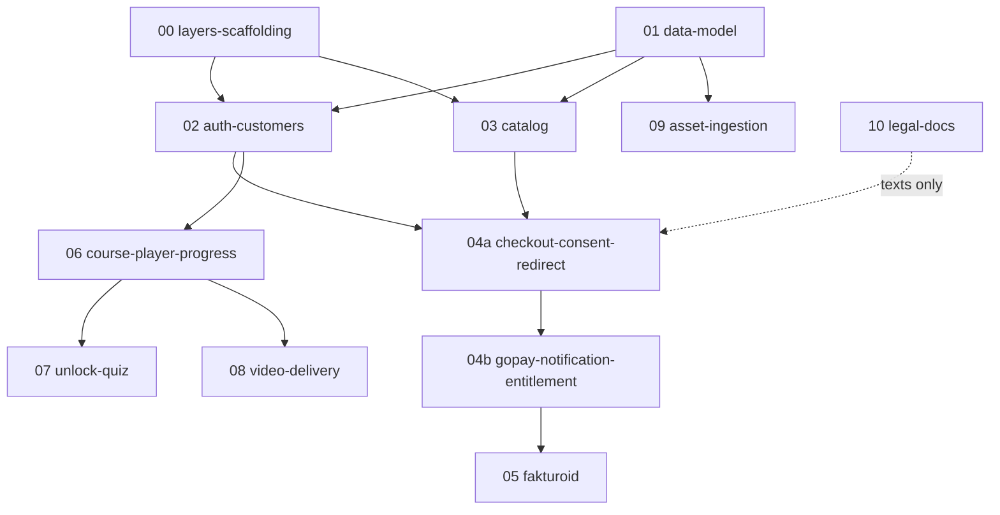

# Implementation areas — kurzy platforma

Decomposition of [prd.md](prd.md) into areas sized for one spec + one agentic
implementation each. Each area gets its own `.aiwork/<date>_<slug>/` spec when
its turn comes; this file only fixes scope, boundaries, and order.

## Dependency graph

Waves: **1** = 00+01 · **2** = 02, 03, 09 (parallel) · **3** = 04a→04b, 06,
08 · **4** = 05, 07 · 10 runs whenever (lawyer-gated, build not blocked).

---

## 00 — Nuxt layers scaffolding (TR-1b)

Restructure `web/` to host Nuxt layers `customers`, `lms`, `shop` over the
existing marketing site. Shared Directus client, styles, runtime config.
Deployment stays one Nitro SSR app on Coolify — no second deployable.

- **Deliverables:** empty-but-wired layers, shared Directus client module,
  build + deploy verified unchanged.
- **Depends on:** nothing.
- **Verify:** `vp run build` passes; existing pages unaffected.

## 01 — Directus data model + permissions (TO-7, TR-1, TR-4, FP-11)

Naming contract, roles and access policies, and the collections wave 2
consumes. Directus is system of record **and** enforcement boundary; get
the permissions right here, not in app code. Later-wave collections are
owned by their consumers: `progress` lands in 06, test/question/attempt
schema in 07 — incremental additions to the committed snapshot are cheap,
and this avoids designing schema two waves before its consumer exists.

- **Collections:** course, section (with unlock-rule config field — the
  unlock engine is 07's, but catalog/player render section metadata),
  lesson (video ref = Stream UID only, attachments), order, consent
  records (N per order: document version + timestamp), entitlement.
  Extensible toward certificates / physical products (R-2, O-8) without
  building them.
- **Roles/policies:** public, student (own transactional rows only,
  entitlement-scoped content), author/admin.
- **Deliverables:** applied Directus schema + policies (snapshot committed),
  seed data for one dummy course, updated `directus-schema.ts` types.
- **Depends on:** nothing.
- **Verify:** anonymous vs. student vs. admin API probes against staging
  Directus; author builds the dummy course entirely through the Directus
  admin app (FP-11 — doubles as the seed-data step).

## 02 — Auth / customers layer (FP-1, O-17, TO-2)

Account-first native Directus email+password auth surfaced in the `customers`
layer: register, login, logout, password reset (Directus → Mailgun, already
configured). Session handling for Nuxt SSR; identity = email. No magic link
in v1.

- **Depends on:** 00, 01.
- **Verify:** full register → reset → login round-trip on staging.

## 03 — Catalog + sales pages (FP-2, BP-2)

Course listing + course detail/sales page in the `shop` layer, content from
Directus. Public, CZK prices, no search (out of scope).

- **Depends on:** 00, 01.
- **Verify:** dummy course renders from staging Directus.

## 04a — Checkout: order + consent + GoPay redirect (FP-3, TO-5)

Order creation for a logged-in student, consent checkboxes (§1837 + terms;
wording placeholder until area 10), redirect to GoPay. Return URL is UX
only — no granting happens here.

- **Depends on:** 02, 03.
- **Verify:** order row + consent rows (document version + timestamp)
  created; redirect reaches GoPay sandbox payment page.

## 04b — GoPay notification + entitlement grant (BP-6, TO-5)

**Server notification endpoint in Nitro** as the sole trigger for granting
the entitlement (idempotent per GoPay payment ID). Abandoned payment =
unpaid order, no entitlement, no invoice.

- **Depends on:** 04a.
- **Verify:** GoPay sandbox end-to-end incl. repeated notification (must not
  double-grant) and abandoned payment.

## 05 — Fakturoid invoicing (FP-4, FP-10, TR-6, TO-4)

Called from the paid-notification flow of 04b: OAuth 2 (client credentials +
refresh-token upkeep), contact → invoice → send to customer (this email is
also the purchase confirmation). Idempotency: invoice ID stored on order;
present ⇒ skip. Tarif Na lehko.

- **Depends on:** 04b.
- **Verify:** sandbox/test account; repeated notification produces exactly
  one invoice.

## 06 — Course player + progress (FP-5, FP-6, FP-9, BP-11, BP-12)

The `lms` layer shell: entitlement-gated course view, section/lesson
navigation reflecting unlock state, text-lesson rendering, downloadable
attachments, per-lesson completion → progress records. Owns the `progress`
collection schema + policies (added to 01's snapshot). Access enforced by
Directus permissions from 01, never by hiding UI (R-5).

- **Depends on:** 02 (+ 01 schema). Sales flow not required — entitlements
  can be seeded manually for development.
- **Verify:** student without entitlement gets API-level denial, not just
  missing UI.

## 07 — Unlock engine + quiz module (BP-13, BP-14, FP-8, R-6)

Per-section unlock rules: (a) test — optionally blocking, (b) manual by
admin, (c) time since purchase (per-student clock from entitlement grant).
Quiz UI: multiple-choice questions, deterministic server-side evaluation
against per-course threshold, attempts stored, unlimited retries, no delay.
Unlocks persist — never re-lock. Owns the test/question/test-attempt
collection schema + policies (added to 01's snapshot).

- **Depends on:** 06.
- **Verify:** matrix of all three rule types + blocking/non-blocking test on
  the dummy course.

## 08 — Secure video delivery (FP-7, TO-1, TR-2)

Nitro endpoint: check entitlement via Directus → issue short-lived signed
Cloudflare Stream playback token. Stream player embedded in the lesson view.
Lesson stores only the Stream UID.

- **Depends on:** 06 (player slot), Cloudflare Stream account.
- **Verify:** token expires; direct/unauthenticated playback URL fails.

## 09 — Asset ingestion (FP-12, TR-7, TR-7b, TO-10)

One Nitro service holding the Cloudflare token, authorizing Directus
author/admin users, routing by MIME: static → Directus files, video →
Stream Direct Creator Upload (tus) + "ready" webhook storing UID/duration/
thumbnail. Two thin frontends: web admin page (drag-and-drop, progress,
ready state) and CLI `upload <path> [--lesson X]` (Deno + dax, Directus
token) usable from Claude Code. Endpoints MCP-ready, no MCP built.

- **Depends on:** 01 (lesson refs); independent of shop/LMS flows — can run
  in wave 2.
- **Verify:** upload an image and a video via both frontends; references
  land on a lesson.

## 10 — Legal documents (BP-16, section 7, O-14)

Content + wiring: obchodní podmínky for digital content, §1837 consent
(likely separate un-prechecked checkbox — lawyer to confirm), pre-contract
info, refund rules, GDPR update. Document **versioning** so consent records
from 04a reference exact versions. Existing pages
`obchodni-podminky.vue` / `zasady-zpracovani-osobnich-udaju.vue` are the
starting point.

- **Depends on:** lawyer input (external); technically only touches 04a's
  checkbox wiring.
- **Verify:** consent record stores correct document version + timestamp.

---

## Shared contracts (fix once, in area 01's spec)

- Collection + field naming (Czech vs. English identifiers) — decide before
  01, everything downstream reads it.
- Layer ownership: `customers` = identity, `shop` = catalog→order→invoice,
  `lms` = entitlement-consumption side. Entitlement is written by `shop`,
  read by `lms`.
- Nitro server routes live inside `web/` (TR-1b): GoPay webhook (04b),
  Fakturoid (05), video token (08), ingestion (09), Stream ready webhook
  (09).
- Idempotency keys: GoPay payment ID (04b), invoice ID on order (05),
  entitlement unique per user × course (04b).
