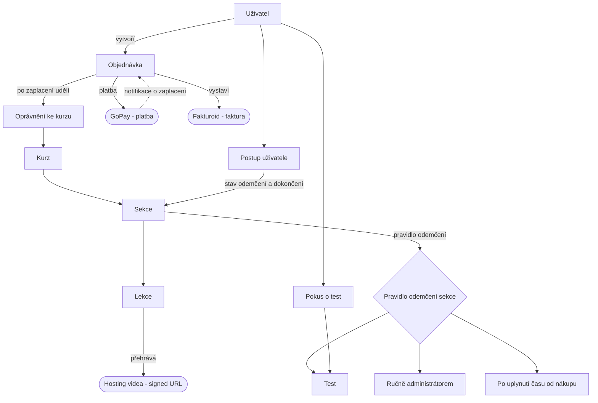

# Specifikace: Eshop s digitálními kurzy Jedlík-nejedlík

Obsah:

- Terminologie
- Funkční specifikace
- Technická specifikace

# Terminologie

E-shop = Část webu Jedlík-nejedlík, kde je možné prohlížet kurzy, zakoupit je a
konzumovat jejich materiály
Student = Uživatel, který konzumuje kurzy
Video kurz = Kurz, který je prodáván v e-shopu
Sekce = Skupina lekcí, které mohou být uzamčené pomocí testu nebo administrátorem
Lekce = Jedno video nebo text, volitelně s doplňkovými materiály
Doplňkové materiály = Statické soubory, které se mohou nahrávat k lekcím
Podklad = Videa, obrázky, PDFka, dokumenty které nejsou veřejné a vyžadují zpracování systémem
Příjem podkladů = Místo v systému kde administrátor nahrává podklady
Uživatel = Kdokoliv kdo konzumuje obsah webu nebo e-shopu
Pravidlo odemčení = Pravidlo, které určuje, kdy může Student postoupit do další Sekce
Kvíz = Úkol nebo test, po splnění kterého může Student postoupit do další Sekce
Postup = Záznam o tom, které lekce má již Student splněné

**Externí systémy**

- Systém pro správu obsahu (CMS), databáze jako služba, správa uživatelů
  - dostupný na adrese https://obsah-jedlika.lttr.cz/
  - technické řešení: Directus
- Platební brána
  - GoPay
  - Již používaný pro SimpleShop
- Fakturační systém
  - Fakturoid
- Hosting videa
  - Cloudflare Stream
- Hosting webu
  - VPS u Hostingeru, správa pomocí Coolify

# Funkční specifikace

## 1. Shrnutí

Platforma pro prodej a zpřístupnění **digitálních kurzů** (především videokurzů) koncovým zákazníkům v České republice. Hlavní odlišností není samotný e-shop, ale **vzdělávací část**: uživatel se přihlásí, zakoupí kurz, prochází jeho sekcemi a pro odemčení další sekce musí **úspěšně složit test**. Tato funkce je autorem kurzu nastavitelná dle potřeby.

## 2. Cíle a hranice

**Cíle (verze 1)**

- Prodávat digitální kurzy (očekává se jednotky nových kurzů ročně).
- Průběh: přihlášení → nákup → zpřístupnění kurzu.
- Postupné procházení výukou s odemykáním sekcí přes testy.
- Bezpečné zpřístupnění videí (videa nesmí jít snadno sdílet dál).
- Běžná platební brána, vystavování faktur jménem spolku.

**Mimo rozsah (verze 1)**

- Fyzické produkty, doprava, sklad.
- Firemní nákupy a hromadné licence.
- Předplatné a opakované platby.
- Vyhledávání v nabídce, doporučování, marketingová automatizace.
- Více měn a ceny mimo CZK.

## 3. Byznysové požadavky

**Produkt a prodej**

- BP-1: Prodej **digitálních kurzů** formou **jednorázového nákupu** s **trvalým přístupem**.
- BP-2: Podpora **malé nabídky** (na startu jeden kurz, prostor pro několik).

**Platby a fakturace**

- BP-5: Přijímat platby v **CZK**.
- BP-6: Po potvrzené platbě **automaticky zpřístupnit** zakoupený kurz.
- BP-7: Ke každému prodeji vystavit fakturu
- BP-8: Fungovat zpočátku jako **neplátce DPH** – faktury bez DPH, s povinným označením „neplátce DPH“.
- BP-9: **Sledovat kumulativní obrat z kurzů** vůči hranici pro povinnou registraci k DPH. **Aktuální hranice (2026): 2 000 000 Kč za kalendářní rok** (plátcovství od 1. 1. následujícího roku; přihláška do 10 prac. dnů), plus druhý limit **2 536 500 Kč (100 000 €)** s okamžitým plátcovstvím. Obrat se nově sleduje **za kalendářní rok** (leden–prosinec), ne za klouzavých 12 měsíců. Sledování obratu i hlídání hranice **řeší Fakturoid** (není potřeba vlastní počítadlo). Fakturaci připravit tak, aby šlo DPH (a režim pro zákazníky z jiných zemí EU) zapnout později jako nastavení, ne jako přestavbu.

**Výuka**

- BP-10: Pro přístup k obsahu se uživatel **registruje / přihlašuje**.
- BP-11: Obsah kurzu členěn na **sekce → lekce** (video + doplňkové materiály).
- BP-12: **Sledování postupu** pro každého uživatele a kurz.
- BP-13: Obsah je po nákupu z velké části **přístupný ihned**. Vybrané sekce/videa se ale odemykají podle **pravidla na úrovni sekce**: (a) po **úspěšném složení testu** – sekce **může** (nemusí) obsahovat test a ten **může** (nemusí) být **blokující**; je-li blokující, jeho složení je podmínkou postupu dál, jinak jde o nezávazné procvičení, (b) ručně administrátorem, nebo (c) automaticky **po uplynutí času od nákupu (udělení oprávnění)** – hodiny každého studenta běží od jeho koupě. Splnění/odemčení se ukládá; při návratu se sekce znovu nezamyká. (Test je jediná automatická brána; ručně hodnocená práce spadá pod variantu b.)
- BP-14: Testy s **hranicí úspěšnosti nastavitelnou pro každý kurz**, otázkami typu **výběr z možností** (deterministicky vyhodnotitelné) a **neomezeným počtem pokusů bez prodlevy**. Otevřené odpovědi a jejich hodnocení přes LLM jsou **až v příští verzi** (viz O-5/O-5b).

**Obsah a právní rámec**

- BP-15: Prodej online kurzů spadá do zapsané činnosti spolku – žádná překážka ze stanov.
- BP-16: Povinné dokumenty pro zákazníky: obchodní podmínky, zásady zpracování osobních údajů (GDPR) a **řešení práva na odstoupení u digitálního obsahu** (souhlas zákazníka s okamžitým dodáním a vzdání se 14denní lhůty – viz otevřené otázky).

## 4. Funkční požadavky (rámcově)

- FP-1: Uživatelské účty (registrace, přihlášení, obnova hesla).
- FP-2: Nabídka kurzů + detail / prodejní stránka kurzu.
- FP-3: Nákupní proces a přesměrování na platbu.
- FP-4: Po potvrzení platby: zpřístupnění kurzu → vystavení faktury → potvrzovací e-mail s fakturou.
- FP-5: Kontrola oprávnění k přístupu vynucená na straně serveru u každého chráněného obsahu.
- FP-6: Přehrávač kurzu: navigace po sekcích/lekcích podle stavu odemčení.
- FP-7: Video zpřístupněno pouze po ověření oprávnění, časově omezeným odkazem.
- FP-8: Testovací modul: zobrazení otázek, vyhodnocení, uložení výsledku a stavu odemčení.
- FP-9: Stav postupu a dokončení pro uživatele.
- FP-10: Vystavení faktury přes fakturační systém spolku po potvrzené platbě + odeslání zákazníkovi; údaje spolku a číselná řada spravovány tímto systémem.
- FP-11: Správa obsahu kurzů, sekcí, lekcí a testů.
- FP-12: **Nahrávání podkladů (obrázky, PDF, video) jedním rozhraním.** Autor se přihlásí jako uživatel Directu, nahraje soubor a systém ho **podle typu** uloží na správné místo (statické → Directus files, video → Cloudflare Stream). K dispozici jako **jednoduchá webová admin stránka** i jako **CLI** (pro nahrávání mj. přes Claude Code). Vrací referenci k uložení k lekci.

## 5. Učiněná rozhodnutí a zdůvodnění

Body, které jsou už z analýzy rozhodnuté (čistě byznysové; technická rozhodnutí viz část B):

- **R-1: Jde o vzdělávací platformu, ne o e-shop.** Nákup je běžná věc; přidaná hodnota je správa přístupu, postup výukou a bezpečná videa – to je 80 % práce.
- **R-2: Verze 1 jen digitální; „možná později fyzické“ je výslovně mimo rozsah.** Fyzické produkty přinášejí dopravu, sklad a jiná pravidla DPH. Datový model se připraví tak, aby fyzické bylo pozdější přídavek, ale teď se nic z toho nestaví.
- **R-3: Jednorázový nákup, trvalý přístup – žádné předplatné.** Zákazník kupuje „možná jeden či pár kurzů“. Předplatné zbytečně komplikuje nákup a vyžaduje zvláštní aktivaci opakovaných plateb. Vynecháváme.
- **R-4: Zachovat stávající platební bránu, ukončit formulářový prodejní systém.** Brána umí české koruny a po platbě automaticky upozorní server, takže lze spolehlivě navázat „zpřístupni uživateli kurz“. Současný formulářový systém dá prodej, ale ne čisté napojení na zpřístupnění obsahu.
- **R-5: Přístup vynucen na serveru.** Pouhé skrytí lekcí ve webu není ochrana. Je potřeba evidence „uživatel × kurz × postup“ a obsah doručovaný přes ověřený přístup.
- **R-6: Úspěšný test odemyká trvale.** Splnění se uloží; při návratu se sekce znovu nezamyká. Jednodušší pro uživatele a netrestá opakované návštěvy.
- **R-7: Prodávajícím je spolek.** Jedlík-nejedlík, z. s. je obchodník i fakturující subjekt bez ohledu na to, kdo videa natočil. Na každé faktuře je IČO/název spolku.
- **R-8: Zatím neplátce DPH, ale s ohledem na hranici.** Pravděpodobně pod hranicí **2 mil. Kč / kalendářní rok** (viz BP-9); obrat z kurzů se do hranice **počítá** (na rozdíl od darů/dotací). Úzká výjimka pro akreditované vzdělávání se na běžný kurz nevztahuje, proto se příjem z kurzů bere jako běžný obrat započítávaný do hranice.

## 6. Otevřené otázky – pro stakeholdery

Většina vyřešena (✅). Zbývající otevřené body jsou na konci sekce.

**Rozsah a ceny**

- O-1 ✅ Verze 1 je **čistě digitální**.
- O-2 ✅ **Pevná cena, bez slevových kódů** ve verzi 1.
- O-3 ✅ Počet kurzů na startu není rozhodující, ale **postupně jich bude přibývat** → návrh počítá s rostoucím katalogem.
- O-4 ✅ Cílení na rodiče vs. odborníky je **jen marketing**, nákup i přístup k obsahu jsou stejné.

**Mechanika kurzů**

- O-5 ✅ Ve verzi 1 testy obsahují **jen výběr z možností**. Otevřené odpovědi (a tím i jejich nespolehlivé automatické vyhodnocení) jsou **odloženy do příští verze**.
- O-6 ✅ Hranice úspěšnosti **nastavitelná pro každý kurz zvlášť** (ne jedna pevná hodnota).
- O-7 ✅ Opakování testu **neomezeně, bez prodlevy**.
- O-8 ✅ Certifikát o dokončení **až později** – datový model na něj připravit, ve verzi 1 nestavět.
- O-10 ✅ U lekcí **mohou být stahovatelné materiály** (přílohy).
- O-13 ✅ Příjem z kurzů se účtuje jako **hlavní činnost** spolku.

**Platby a právo**

- O-11 ✅ Spolek zůstává **neplátcem DPH**, bez brzkého očekávání překročení **hranice 2 mil. Kč / kalendářní rok** (viz BP-9).
- O-12 ✅ Stávající **Fakturovac.cz nemá API** → přechod na **Fakturoid** (tarif Na lehko). Smluvní vazba na Fakturovac neřešena jako blokující (fakturační nástroj lze měnit volně).
- O-15 ✅ **GoPay účet je připravený** pod spolkem.
- O-16 ✅ **Žádná smluvní vázanost** na SimpleShop ani GoPay – technologie lze měnit.

### Vyřešeno dodatečně

- O-9 ✅ Obsah je po nákupu **z velké části přístupný hned**. Vybrané sekce/videa se odemykají individuálně podle pravidla: po **úspěšném složení testu**, ručně administrátorem, nebo po **uplynutí času od nákupu**. → odemykání je tedy **pravidlo na úrovni sekce**, ne jediný globální režim (viz BP-13, O-18, O-19, TO-7).
- O-5b ⏭️ **Odloženo do příští verze.** Až přibudou otevřené odpovědi, budou se vyhodnocovat přes LLM (rubriky, náklady, latence, nedeterminismus, ruční přehodnocení u hraničních výsledků). Ve verzi 1 se LLM nepoužívá vůbec.
- O-17 ✅ **Účet-první (account-first):** zákazník se registruje / přihlásí **před nákupem**, takže objednávka i oprávnění se vážou na známého studenta a odpadá párování platby k dodatečně vzniklému účtu. Identitou je **e-mail**.
- O-18 ✅ **Test je jediná automatická brána** odemčení (varianta a). Žádná samostatná entita „úkol"; ručně posuzovaná práce se řeší ručním odemčením administrátorem (varianta b).
- O-19 ✅ **Časové odemčení (varianta c) se měří od nákupu / udělení oprávnění** – per-student, ne absolutní datum a ne od odemčení předchozí sekce.

### Stále otevřené

- O-14 ◐ **Technické uložení souhlasu vyřešeno** (N záznamů souhlasu k objednávce, každý s verzí dokumentu a časovým razítkem – viz TO-7 a sekce 7). **Stále otevřené (právní, ne technické):** sada samotných právních dokumentů a finální forma checkboxů (zejm. samostatný §1837) – k doladění s právníkem / šablonou. Build to neblokuje.

## 7. Právní dokumenty (O-14)

Potřebné dokumenty a povinnosti (není právní rada – doporučeno ověřit s právníkem / použít šablonu pro prodej digitálního obsahu):

- **Obchodní podmínky** pro digitální obsah – prodávající (spolek, IČO), plnění, cena, způsob dodání.
- **Souhlas s okamžitým dodáním + ztrátou práva na odstoupení** (§ 1837 OZ) – výslovný souhlas před nákupem. **Proč na tom záleží:** bez tohoto výslovného souhlasu má zákazník 14denní lhůtu na odstoupení a může žádat vrácení peněz **i po zhlédnutí kurzu**; s ním lze u již zpřístupněného digitálního obsahu odstoupení odmítnout. **Forma (jeden společný vs. samostatný výslovný checkbox §1837) – k potvrzení s právníkem;** právní konsenzus se kloní k **samostatnému, nepředzaškrtnutému** souhlasu. **Technicky (vyřešeno): k objednávce se ukládá N záznamů souhlasu, každý s verzí dokumentu a časovým razítkem** – datový model unese obě varianty, takže build to neblokuje.
- **Předsmluvní informace** pro prodej na dálku (§ 1820 OZ).
- **Reklamační řád / pravidla vrácení peněz**.
- **Zásady zpracování osobních údajů (GDPR)**.

## 8. Výslovně mimo rozsah

Fyzické produkty, doprava, sklad; předplatné/opakované platby; firemní hromadné licence; více měn; jiný jazyk rozhraní než čeština; vyhledávání v nabídce; certifikáty (plánováno později, viz O-8); **otevřené odpovědi v testech a jejich hodnocení přes LLM** (příští verze, viz O-5/O-5b/TO-9).

---

# ČÁST B – Technická specifikace

> Tato část obsahuje všechny technické pojmy, názvy nástrojů/frameworků a technická rozhodnutí. Pro stakeholdery není nutná.

## B.1 Použitý a zvažovaný technologický stack

- **Frontend / aplikace:** Nuxt (existující web), TypeScript, Vue 3.
- **CMS / správa obsahu:** Directus.
- **Organizace kódu:** monorepo (samostatná aplikace v něm).
- **Platební brána:** GoPay (nativně v CZK).
- **Fakturace:** Fakturoid – **API v3** (REST, autorizace **OAuth 2**, webhooky). API dostupné ve všech tarifech; tarif **Na lehko** (1 500 požadavků/měs. ≈ 500 faktur) na rozjezd stačí, neomezené kontakty. Vystavení 1 faktury ≈ 3 požadavky (kontakt → faktura → odeslání).
- **Zamítnutý fakturační nástroj:** Fakturovac.cz (stávající) – **nemá API**, jen ruční tvorba PDF; nepoužitelné pro automatizaci.
- **Současný prodejní systém k ukončení:** SimpleShop (formulářový prodej).
- **Video:** **Cloudflare Stream** (rozhodnuto, viz TO-1). Vlastní hosting na VPS zamítnut pro v1.
- **Infrastruktura:** Cloudflare, VPS.

## B.2 Technická rozhodnutí a zdůvodnění

- **TR-1: Directus je systém záznamu i hranice vynucení; Nitro je jen tenká důvěryhodná výpočetní vrstva.** Záměrně jednoduchá architektura odpovídající malému rozsahu a tomu, že CMS i kurzy spravují titíž lidé. Directus drží **obsah i transakční data** (studenti, objednávky, oprávnění, postup, pokusy) a je **poskytovatelem identity** i **primární branou přístupu** (oprávnění Directu). Vlastní backend (Nitro – samostatná aplikace v monorepu, případně součást webu) se používá **jen pro operace vyžadující tajný klíč nebo serverovou logiku** (podpis URL videa, GoPay webhook, volání Fakturoidu); data vždy ukládá zpět do Directu a **nikdy se nestává druhým systémem záznamu**. Tam, kde je to pohodlnější, lze místo Nitro použít rozšíření/Flows přímo v Directu.
- **TR-1b: Jeden nasazovaný celek (stávající Nuxt aplikace `web/`), členěný na Nuxt vrstvy (layers) podle oblastí.** Žádná druhá samostatná aplikace – `web/` už běží jako Node/Nitro SSR (Nixpacks → Coolify), takže autentizované stránky i serverové endpointy (webhook GoPay, podpis videa, Fakturoid) se přidají do něj. Modularita se drží přes vrstvy, jedna na oblast: **`customers`** (identita/autentizace), **`lms`** (kurzy, sekce, lekce, postup, testy, video) a **`shop`** (katalog, košík/checkout, platby, fakturace), nad stávajícím marketingovým webem. Sdílí se Directus klient, komponenty, styly a běhové prostředí. Jde o **vrstvy uvnitř jednoho ohraničeného kontextu** (společný jazyk: Kurz, Student, Oprávnění), ne o samostatné kontexty. Samostatné nasazení až kdyby to transakční část opravdu vyžadovala.
- **TR-2: Video se nenahrává do Directu.** Directus řeší strukturovaný obsah a metadata, ne překódování, adaptivní bitrate ani zabezpečené doručení. Directus drží jen referenci na video u lekce.
- **TR-3: GoPay přes serverové notifikace.** GoPay po změně stavu platby pošle notifikaci (ID platby → dotaz na stav), což je přesně ten hook pro zpřístupnění kurzu. SimpleShop tohle čisté strojové napojení nemá.
- **TR-4: Vynucení oprávnění na straně serveru.** Skrytí ve frontendu není řízení přístupu; nutná evidence „student × kurz × postup“ a obsah přes autorizovaný přístup. Konkrétně tuto bránu tvoří **oprávnění Directu** (viz TR-1) – ne zvláštní vlastní autorizační vrstva.
- **TR-6: Fakturace přes Fakturoid API (v3), ne vlastní PDF ani Fakturovac.** Po notifikaci z GoPay aplikace zavolá Fakturoid API → vytvoří kontakt, vystaví fakturu a odešle ji zákazníkovi. Číselnou řadu i hlídání DPH řeší Fakturoid. Stačí tarif **Na lehko**. Pozor: autorizace přes **OAuth 2** (Client ID/Secret + správa refresh tokenu – jednorázová režie navíc oproti tokenovému API), a volat 1× na platbu, ne polling.

- **TR-7: Asset ingestion service v Nitro vrstvě (sdílená logika, dvě rozhraní).** Jedna serverová logika v důvěryhodné Nitro vrstvě drží Cloudflare token, ověří, že volající je **uživatel Directu** s rolí autor/admin, a **routuje podle MIME typu**: obrázky/PDF/dokumenty → **Directus files**; video → **Cloudflare Stream** přes **Direct Creator Upload** (jednorázová tus upload URL; prohlížeč/CLI nahrává přímo do Streamu, ne přes náš server) + **webhook „ready"** (uloží UID, délku, náhled). Volitelně **preprocess obrázků přes sharp** před uložením. Nad touto logikou stojí dvě tenká rozhraní: **(a) jednoduchá webová admin stránka** (přihlášení jako Directus uživatel, drag-and-drop, průběh + stav „ready") a **(b) CLI** (Deno + dax) ověřené Directus tokenem, použitelné mj. z Claude Code. Directus zůstává úložištěm i autentizací (a dělá on-the-fly transformace obrázků). Tím Nitro vrstva získává jen jednu novou odpovědnost: příjem podkladů.
- **TR-7b: Agentní rozhraní = CLI (jeden příkaz), ne MCP.** Cíl: „řekni Claude Code, ať vezme soubor a nahraje ho, zbytek se stane." Claude Code má lokální souborový systém i shell, takže jediný příkaz `upload <cesta> [--lesson X]` přesně tohle dělá: zjistí typ, nahraje na správné místo (Directus / Stream přes direct upload), počká na „ready" a zapíše referenci. **MCP zvažováno a odloženo** – lokální stdio MCP (čte cesty, ale nutná instalace per-stroj) i vzdálené MCP v Nitro (jeden server a auth, ale na velké soubory nutný vzor „vydej upload URL", ne posílání bajtů); ani jedno nepřináší pro jediného shellového agenta hodnotu navíc oproti CLI. Endpointy se navrhnou tak, aby šel **MCP adaptér** doplnit později bez přepisu, kdyby ho potřeboval ne-shellový klient. (Pozn.: stávající **Directus MCP neumí nahrát lokální soubor** – akce jsou jen read/update/delete/**import z URL**, `assets` je jen ke čtení – takže pro nahrávání by stejně musel vzniknout vlastní MCP; velké video přes MCP/JSON jako base64 je navíc nevhodné, proto by i vzdálené MCP muselo stavět na „vydej upload URL".)

## B.3 Technické otevřené otázky

- TO-1 ✅ **Hosting videa: Cloudflare Stream.** Řeší překódování, adaptivní bitrate i podepsané (signed) přehrávání out-of-the-box; využívá stávající Cloudflare infrastrukturu. Mechanika: Nitro po ověření oprávnění (přes Directus) vydá **krátkodobý podepsaný token** k přehrání. Lekce drží **jen ID videa ve Stream** (viz TR-2). VPS zvážit znovu, až by objem doručování činil cenu Streamu citelnou.
- TO-2 ✅ **Autentizace** – vyřešeno: **nativní e-mail + heslo v Directu**, model **účet-první** (registrace/přihlášení před nákupem), identitou je e-mail. Bezheslové přihlášení (magic link) **odloženo** na později – Directus to nativně neumí (jen lokální heslo a SSO), implementovalo by se v Nitro nebo přes komunitní rozšíření; datový model kvůli tomu měnit netřeba.
- TO-3 ✅ **Role Directu** – vyřešeno opačně, než zněla původní otázka: Directus **je** systém záznamu i **primární hranice vynucení** (oprávnění Directu), nejen úložiště. Viz TR-1.
- TO-4 ✅ **Číslování faktur** – řeší Fakturoid (jediný zdroj pravdy). Idempotence: **jedna platba = jedna faktura** i při opakované notifikaci z GoPay – k objednávce se ukládá **ID faktury**; je-li už vyplněno, faktura se znovu nevystavuje. Stejně idempotentní je i udělení oprávnění.
- TO-5 ✅ **Tvar integrace GoPay: redirect.** Prohlížeč přesměruje na platební stránku GoPay a zpět na potvrzovací URL. Návratová URL slouží **jen k UX**; zpřístupnění kurzu, vystavení faktury i potvrzovací e-mail spouští až **serverová notifikace** (GoPay → Nitro), ne návrat prohlížeče. **Notifikační endpoint je idempotentní** podle ID platby GoPay (notifikace se mohou opakovat). Opuštěné/neúspěšné platby zůstávají jako nezaplacená objednávka bez oprávnění a faktury. Inline integrace je možné vylepšení do budoucna.
- TO-6 ✅ **Odesílání e-mailů** – využít stávající stack, žádný nový poskytovatel. **Fakturoid** posílá fakturu (slouží i jako potvrzení nákupu, FP-4). Auth e-maily (obnova hesla; později magic link) a případné další app e-maily jdou přes **Directus, který už má nakonfigurovaný Mailgun** (vyřešená doručitelnost/DKIM); Nitro může v případě potřeby použít týž Mailgun.
- TO-7: **Datový model** pro `produkt / objednávka / oprávnění / postup / pokus o test` – dostatečně obecný, aby fyzické produkty, certifikáty (plánováno později) a později licenční místa byly přídavkem. Sekce má **pravidlo odemčení** (test, ruční administrátorem, čas od nákupu) jako konfiguraci, ne natvrdo. Sekce **volitelně** obsahuje **Test**, který je **volitelně blokující** (pole `blocking`); blokující test musí být složen pro postup dál. K objednávce se ukládá **záznam souhlasu** (§ 1837 OZ – datum, verze podmínek).
- TO-10 ◐ **Asset ingestion je součást v1.0** (ne odložené). Webová admin stránka i CLI hned od startu (viz FP-12, TR-7). K doladění při implementaci: konkrétní podoba Cloudflare Stream **Direct Creator Upload** (tus) a **ready webhooku**, autorizace CLI (Directus token s rolí autor/admin), mapování MIME → cíl, volitelný sharp preprocess obrázků. MCP adaptér odložen (endpointy ale MCP-ready, viz TR-7b).
- TO-8 ✅ **Migrace: čistý start, bez přenosu.** Nová platforma startuje prázdná; žádný importér se nestaví a stávající kupující ze SimpleShopu se nepřenášejí (historie objednávek zůstává v SimpleShopu/Fakturovaci).
- TO-9 ⏭️ **Mimo rozsah verze 1 (příští verze).** Vyhodnocení otevřených odpovědí přes LLM – volba modelu a hostingu, zadání kritérií (rubriky) pro každou otázku, práh úspěšnosti, náklady a latence, možnost ručního přehodnocení u hraničních výsledků, ochrana proti prompt injection v odpovědích studentů.

## B.4 Zvažované a zamítnuté alternativy

- **Fakturovac.cz (stávající fakturace)** – zamítnuto: nemá API, jen ruční PDF. Nelze automatizovat vystavení faktury po platbě.
- **Vyfakturuj.cz** – reálná alternativa k Fakturoidu (API v2, tokenová autorizace, sleva 30 % pro neziskovky, příbuznost se SimpleShop). Zamítnuto ve prospěch Fakturoidu kvůli lepší dokumentaci a API ve všech tarifech; rozdíl je malý, lze se k němu vrátit.
- **FAPI** – zamítnuto jako celková platforma: řeší prodej + fakturaci + členské sekce, ale jeho LMS část je WordPress plugin (mimo Nuxt/Directus stack) a neumí test-gated progresi (odemyká podle platby, ne podle splnění testu). Duplikoval by prodej/fakturaci, kterou už řeší GoPay + Fakturoid, a unikátní jádro projektu (LMS s testy) by stejně bylo nutné psát vlastní. Dávalo by smysl jen při úplném zrušení vlastního vývoje a rezignaci na test-gating.
- **Stripe** – zvažováno místo GoPay (lepší EU OSS/DPH automatizace, předplatné, fakturace). Zamítnuto pro verzi 1: GoPay je zavedená, nativně v CZK a pro jednorázový nákup plně dostačuje. Relevantní až při expanzi do EU nebo zavedení předplatného.

## B.5 Konceptuální diagram

Vztahy mezi hlavními entitami a vnějšími službami (bez detailu polí).

