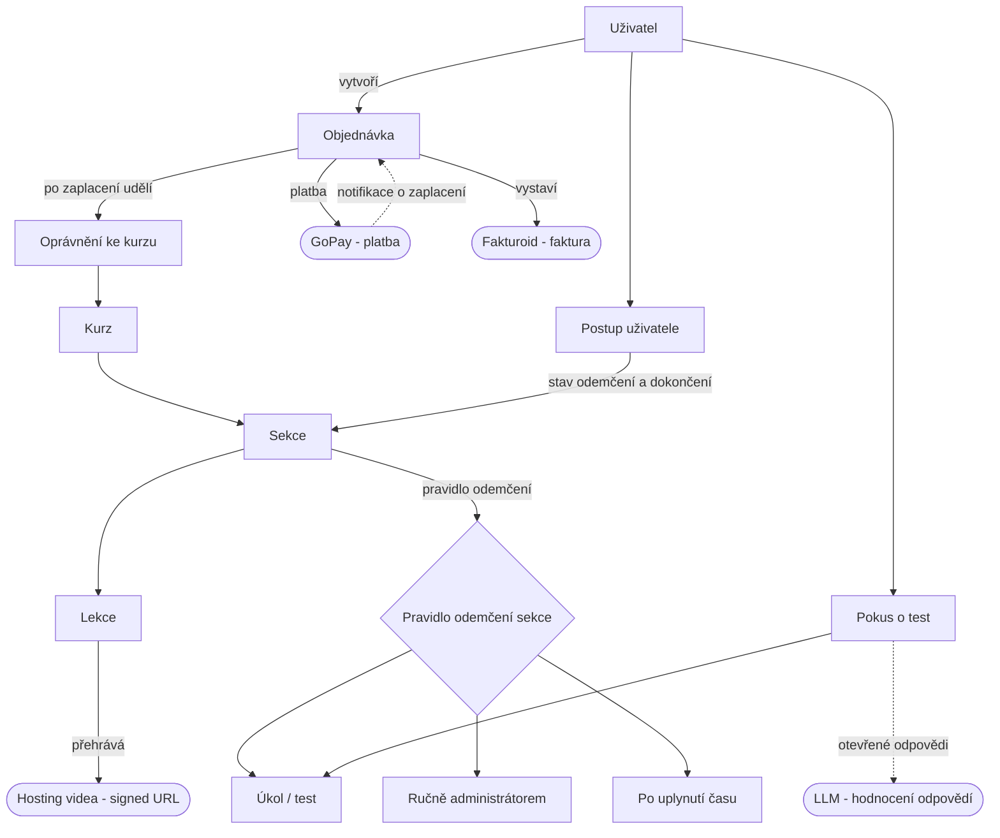

# Specifikace produktu – Platforma kurzů a prodeje Jedlík-nejedlík

**Stav:** Pracovní verze v0.1 (analýza)
**Prodávající subjekt:** Jedlík-nejedlík, z. s. – IČO 19971192 (zapsaný spolek, KS Hradec Králové)
**Kontext:** jedlik-nejedlik.cz – výživa a výchova; cílové skupiny: rodiče a odborníci; existující podcast.

> Veškeré technické pojmy, názvy nástrojů a technická rozhodnutí jsou vyčleněny do **části B (Technická specifikace)** na konci dokumentu. Část A je čistě byznysová a je určena pro stakeholdery.

---

# ČÁST A – Byznysová specifikace

## 1. Shrnutí

Platforma pro prodej a zpřístupnění **digitálních kurzů** (především videokurzů) koncovým zákazníkům v České republice. Hlavní odlišností není samotný e-shop, ale **vzdělávací část**: uživatel se přihlásí, zakoupí kurz, prochází jeho sekcemi a pro odemčení další sekce musí **úspěšně složit test**. Nákup a platba jsou běžně řešená věc; skutečná práce je ve správě přístupu k obsahu, postupu výukou a bezpečném zpřístupnění videí.

Řešení nahradí současný způsob prodeje přes jednoduchý formulářový systém.

## 2. Cíle a hranice

**Cíle (verze 1)**

- Prodávat digitální kurzy (na začátku se očekává jeden hlavní videokurz, postupně malá nabídka).
- Průběh: přihlášení → nákup → zpřístupnění kurzu.
- Postupné procházení výukou s odemykáním sekcí přes testy.
- Bezpečné zpřístupnění videí (videa nesmí jít snadno sdílet dál).
- Vystavování platných faktur jménem spolku.
- Čeština, primárně český trh.

**Mimo rozsah (verze 1)**

- Fyzické produkty, doprava, sklad.
- Firemní nákupy / hromadné licence (více míst).
- Předplatné / opakované platby.
- Vyhledávání v nabídce, doporučování, marketingová automatizace.
- Více měn / ceny mimo CZK.

## 3. Byznysové požadavky

**Produkt a prodej**

- BP-1: Prodej **digitálních kurzů** formou **jednorázového nákupu** s **trvalým přístupem**.
- BP-2: Podpora **malé nabídky** (na startu jeden kurz, prostor pro několik).
- BP-3: Kupující = student. Žádné firemní ani víceuživatelské nákupy (verze 1).
- BP-4: Cílové skupiny dle webu: **rodiče** a **odborníci**. Mělo by být možné kurz cílit/směřovat na jednu skupinu.

**Platby a fakturace**

- BP-5: Přijímat platby v **CZK**. Ukončit používání stávajícího formulářového prodejního systému.
- BP-6: Po potvrzené platbě **automaticky zpřístupnit** zakoupený kurz.
- BP-7: Ke každému prodeji vystavit **platnou fakturu s řadovým číslem** jménem Jedlík-nejedlík, z. s. (IČO 19971192).
- BP-8: Fungovat zpočátku jako **neplátce DPH** – faktury bez DPH, s povinným označením „neplátce DPH“.
- BP-9: **Sledovat kumulativní obrat z kurzů** vůči hranici pro povinnou registraci k DPH (1 mil. Kč / 12 měsíců); fakturaci připravit tak, aby šlo DPH (a režim pro zákazníky z jiných zemí EU) zapnout později jako nastavení, ne jako přestavbu.

**Výuka**

- BP-10: Pro přístup k obsahu se uživatel **registruje / přihlašuje**.
- BP-11: Obsah kurzu členěn na **sekce → lekce** (video + doplňkové materiály).
- BP-12: **Sledování postupu** pro každého uživatele a kurz.
- BP-13: Obsah je po nákupu z velké části **přístupný ihned**. Vybrané sekce/videa se ale odemykají podle **pravidla na úrovni sekce**: (a) po splnění úkolu/testu, (b) ručně administrátorem, nebo (c) automaticky po uplynutí času. Splnění/odemčení se ukládá; při návratu se sekce znovu nezamyká.
- BP-14: Testy s **hranicí úspěšnosti nastavitelnou pro každý kurz**, otázkami typu výběr z možností (a volitelně otevřené odpovědi – viz O-5b) a **neomezeným počtem pokusů bez prodlevy**.

**Obsah a právní rámec**

- BP-15: Prodej online kurzů spadá do zapsané činnosti spolku – žádná překážka ze stanov.
- BP-16: Povinné dokumenty pro zákazníky: obchodní podmínky, zásady zpracování osobních údajů (GDPR) a **řešení práva na odstoupení u digitálního obsahu** (souhlas zákazníka s okamžitým dodáním a vzdání se 14denní lhůty – viz otevřené otázky).

## 4. Funkční požadavky (rámcově)

- FP-1: Uživatelské účty (registrace, přihlášení, obnova hesla).
- FP-2: Nabídka kurzů + detail / prodejní stránka kurzu.
- FP-3: Nákupní proces a přesměrování na platbu.
- FP-4: Po potvrzení platby: zpřístupnění kurzu → vystavení faktury → potvrzovací e-mail s fakturou.
- FP-5: Kontrola oprávnění k přístupu vynucená na straně serveru u každého chráněného obsahu.
- FP-6: Přehrávač kurzu: navigace po sekcích/lekcích podle stavu odemčení.
- FP-7: Video zpřístupněno pouze po ověření oprávnění, časově omezeným odkazem.
- FP-8: Testovací modul: zobrazení otázek, vyhodnocení, uložení výsledku a stavu odemčení.
- FP-9: Stav postupu a dokončení pro uživatele.
- FP-10: Vystavení faktury přes fakturační systém spolku po potvrzené platbě + odeslání zákazníkovi; údaje spolku a číselná řada spravovány tímto systémem.
- FP-11: Správa obsahu kurzů, sekcí, lekcí a testů.

## 5. Učiněná rozhodnutí a zdůvodnění

Body, které jsou už z analýzy rozhodnuté (čistě byznysové; technická rozhodnutí viz část B):

- **R-1: Jde o vzdělávací platformu, ne o e-shop.** Nákup je běžná věc; přidaná hodnota je správa přístupu, postup výukou a bezpečná videa – to je 80 % práce.
- **R-2: Verze 1 jen digitální; „možná později fyzické“ je výslovně mimo rozsah.** Fyzické produkty přinášejí dopravu, sklad a jiná pravidla DPH. Datový model se připraví tak, aby fyzické bylo pozdější přídavek, ale teď se nic z toho nestaví.
- **R-3: Jednorázový nákup, trvalý přístup – žádné předplatné.** Zákazník kupuje „možná jeden či pár kurzů“. Předplatné zbytečně komplikuje nákup a vyžaduje zvláštní aktivaci opakovaných plateb. Vynecháváme.
- **R-4: Zachovat stávající platební bránu, ukončit formulářový prodejní systém.** Brána umí české koruny a po platbě automaticky upozorní server, takže lze spolehlivě navázat „zpřístupni uživateli kurz“. Současný formulářový systém dá prodej, ale ne čisté napojení na zpřístupnění obsahu.
- **R-5: Přístup vynucen na serveru.** Pouhé skrytí lekcí ve webu není ochrana. Je potřeba evidence „uživatel × kurz × postup“ a obsah doručovaný přes ověřený přístup.
- **R-6: Úspěšný test odemyká trvale.** Splnění se uloží; při návratu se sekce znovu nezamyká. Jednodušší pro uživatele a netrestá opakované návštěvy.
- **R-7: Prodávajícím je spolek.** Jedlík-nejedlík, z. s. je obchodník i fakturující subjekt bez ohledu na to, kdo videa natočil. Na každé faktuře je IČO/název spolku.
- **R-8: Zatím neplátce DPH, ale s ohledem na hranici.** Pravděpodobně pod hranicí 1 mil. Kč; obrat z kurzů se do hranice **počítá** (na rozdíl od darů/dotací). Úzká výjimka pro akreditované vzdělávání se na běžný kurz nevztahuje, proto se příjem z kurzů bere jako běžný obrat započítávaný do hranice.

## 6. Otevřené otázky – pro stakeholdery

Většina vyřešena (✅). Zbývající otevřené body jsou na konci sekce.

**Rozsah a ceny**

- O-1 ✅ Verze 1 je **čistě digitální**.
- O-2 ✅ **Pevná cena, bez slevových kódů** ve verzi 1.
- O-3 ✅ Počet kurzů na startu není rozhodující, ale **postupně jich bude přibývat** → návrh počítá s rostoucím katalogem.
- O-4 ✅ Cílení na rodiče vs. odborníky je **jen marketing**, nákup i přístup k obsahu jsou stejné.

**Mechanika kurzů**

- O-5 ⚠️ Testy mají obsahovat **výběr z možností i otevřené odpovědi**. Pozor: otevřené odpovědi nejdou spolehlivě automaticky vyhodnotit – viz otevřený bod níže.
- O-6 ✅ Hranice úspěšnosti **nastavitelná pro každý kurz zvlášť** (ne jedna pevná hodnota).
- O-7 ✅ Opakování testu **neomezeně, bez prodlevy**.
- O-8 ✅ Certifikát o dokončení **až později** – datový model na něj připravit, ve verzi 1 nestavět.
- O-10 ✅ U lekcí **mohou být stahovatelné materiály** (přílohy).
- O-13 ✅ Příjem z kurzů se účtuje jako **hlavní činnost** spolku.

**Platby a právo**

- O-11 ✅ Spolek zůstává **neplátcem DPH**, bez brzkého očekávání překročení 1 mil. Kč.
- O-12 ✅ Stávající **Fakturovac.cz nemá API** → přechod na **Fakturoid** (tarif Na lehko). Smluvní vazba na Fakturovac neřešena jako blokující (fakturační nástroj lze měnit volně).
- O-15 ✅ **GoPay účet je připravený** pod spolkem.
- O-16 ✅ **Žádná smluvní vázanost** na SimpleShop ani GoPay – technologie lze měnit.

### Vyřešeno dodatečně

- O-9 ✅ Obsah je po nákupu **z velké části přístupný hned**. Vybrané sekce/videa se odemykají individuálně podle pravidla: po splnění úkolu/testu, ručně administrátorem, nebo po uplynutí času. → odemykání je tedy **pravidlo na úrovni sekce**, ne jediný globální režim (viz BP-13, TO model).
- O-5b ✅ Otevřené odpovědi v testu se budou **vyhodnocovat přes LLM**. Akceptováno s vědomím dopadů: vyžaduje volání LLM při hodnocení, zadání kritérií (rubriky), počítat s náklady, latencí a nedeterminismem (vhodné u hraničních výsledků umožnit ruční přehodnocení).

### Stále otevřené

- O-14: Sada právních dokumentů a technické uložení souhlasu – viz samostatný bod níže (k doladění s právníkem / šablonou).

## 7. Právní dokumenty (O-14)

Potřebné dokumenty a povinnosti (není právní rada – doporučeno ověřit s právníkem / použít šablonu pro prodej digitálního obsahu):

- **Obchodní podmínky** pro digitální obsah – prodávající (spolek, IČO), plnění, cena, způsob dodání.
- **Souhlas s okamžitým dodáním + ztrátou práva na odstoupení** (§ 1837 OZ) – výslovný souhlas před nákupem; **technicky: uložit záznam souhlasu k objednávce** (datum, verze podmínek).
- **Předsmluvní informace** pro prodej na dálku (§ 1820 OZ).
- **Reklamační řád / pravidla vrácení peněz**.
- **Zásady zpracování osobních údajů (GDPR)**.

## 8. Výslovně mimo rozsah

Fyzické produkty, doprava, sklad; předplatné/opakované platby; firemní hromadné licence; více měn; jiný jazyk rozhraní než čeština; vyhledávání v nabídce; certifikáty (plánováno později, viz O-8); časové uvolňování (čeká na O-9).

---

# ČÁST B – Technická specifikace

> Tato část obsahuje všechny technické pojmy, názvy nástrojů/frameworků a technická rozhodnutí. Pro stakeholdery není nutná.

## B.1 Použitý a zvažovaný technologický stack

- **Frontend / aplikace:** Nuxt (existující web), TypeScript, Vue 3.
- **CMS / správa obsahu:** Directus.
- **Organizace kódu:** monorepo (samostatná aplikace v něm).
- **Platební brána:** GoPay (nativně v CZK).
- **Fakturace:** Fakturoid – **API v3** (REST, autorizace **OAuth 2**, webhooky). API dostupné ve všech tarifech; tarif **Na lehko** (1 500 požadavků/měs. ≈ 500 faktur) na rozjezd stačí, neomezené kontakty. Vystavení 1 faktury ≈ 3 požadavky (kontakt → faktura → odeslání).
- **Zamítnutý fakturační nástroj:** Fakturovac.cz (stávající) – **nemá API**, jen ruční tvorba PDF; nepoužitelné pro automatizaci.
- **Současný prodejní systém k ukončení:** SimpleShop (formulářový prodej).
- **Video (zvažováno):** Cloudflare Stream vs. vlastní hosting na VPS.
- **Infrastruktura:** Cloudflare, VPS.

## B.2 Technická rozhodnutí a zdůvodnění

- **TR-1: Samostatná aplikace ve stejném monorepu.** Čistá hranice autentizace a oprávnění, oddělená od prezentačního webu, při sdílení Directu a nástrojů. Lepší než vestavět logiku výuky do veřejné Nuxt aplikace.
- **TR-2: Video se nenahrává do Directu.** Directus řeší strukturovaný obsah a metadata, ne překódování, adaptivní bitrate ani zabezpečené doručení. Directus drží jen referenci na video u lekce.
- **TR-3: GoPay přes serverové notifikace.** GoPay po změně stavu platby pošle notifikaci (ID platby → dotaz na stav), což je přesně ten hook pro zpřístupnění kurzu. SimpleShop tohle čisté strojové napojení nemá.
- **TR-4: Vynucení oprávnění na straně serveru.** Skrytí ve frontendu není řízení přístupu; nutná evidence „uživatel × kurz × postup“ a obsah přes autorizovaný endpoint.
- **TR-6: Fakturace přes Fakturoid API (v3), ne vlastní PDF ani Fakturovac.** Po notifikaci z GoPay aplikace zavolá Fakturoid API → vytvoří kontakt, vystaví fakturu a odešle ji zákazníkovi. Číselnou řadu i hlídání DPH řeší Fakturoid. Stačí tarif **Na lehko**. Pozor: autorizace přes **OAuth 2** (Client ID/Secret + správa refresh tokenu – jednorázová režie navíc oproti tokenovému API), a volat 1× na platbu, ne polling.

## B.3 Technické otevřené otázky

- TO-1: **Hosting videa** – Cloudflare Stream vs. vlastní VPS (rozhoduje poměr cena vs. čas). _(náklon: Cloudflare Stream pro verzi 1)_
- TO-2: **Autentizace** – využít existující systém identit, uživatele v Directu, nebo dedikovanou vrstvu pro aplikaci výuky? Vztah k případným účtům na prezentačním webu?
- TO-3: **Role Directu** – pouze úložiště obsahu a dat o oprávněních, s vynucením v aplikační vrstvě? Potvrdit, že Directus sám není hranicí vynucení.
- TO-4: **Číslování faktur** – vlastní Fakturoid (jediný zdroj pravdy). Ověřit jen idempotenci: jedna platba = jedna faktura i při opakované notifikaci z GoPay (ukládat vazbu objednávka → ID faktury).
- TO-5: **Tvar integrace GoPay** – inline vs. redirect platba; idempotence notifikačního endpointu (notifikace se mohou opakovat); řešení opuštěných/neúspěšných plateb.
- TO-6: **Odesílání e-mailů** – transakční poskytovatel pro potvrzení a faktury?
- TO-7: **Datový model** pro `produkt / objednávka / oprávnění / postup / pokus o test` – dostatečně obecný, aby fyzické produkty, certifikáty (plánováno později) a později licenční místa byly přídavkem. Sekce má **pravidlo odemčení** (úkol/test, ruční administrátorem, čas) jako konfiguraci, ne natvrdo. K objednávce se ukládá **záznam souhlasu** (§ 1837 OZ – datum, verze podmínek).
- TO-8: **Migrace** – importovat stávající zákazníky/objednávky ze SimpleShopu, nebo čistý start?
- TO-9: **Vyhodnocení otevřených odpovědí přes LLM** – volba modelu a hostingu, zadání kritérií (rubriky) pro každou otázku, práh úspěšnosti, náklady a latence, možnost ručního přehodnocení u hraničních výsledků, ochrana proti prompt injection v odpovědích studentů.

## B.4 Zvažované a zamítnuté alternativy

- **Fakturovac.cz (stávající fakturace)** – zamítnuto: nemá API, jen ruční PDF. Nelze automatizovat vystavení faktury po platbě.
- **Vyfakturuj.cz** – reálná alternativa k Fakturoidu (API v2, tokenová autorizace, sleva 30 % pro neziskovky, příbuznost se SimpleShop). Zamítnuto ve prospěch Fakturoidu kvůli lepší dokumentaci a API ve všech tarifech; rozdíl je malý, lze se k němu vrátit.
- **FAPI** – zamítnuto jako celková platforma: řeší prodej + fakturaci + členské sekce, ale jeho LMS část je WordPress plugin (mimo Nuxt/Directus stack) a neumí test-gated progresi (odemyká podle platby, ne podle splnění testu). Duplikoval by prodej/fakturaci, kterou už řeší GoPay + Fakturoid, a unikátní jádro projektu (LMS s testy) by stejně bylo nutné psát vlastní. Dávalo by smysl jen při úplném zrušení vlastního vývoje a rezignaci na test-gating.
- **Stripe** – zvažováno místo GoPay (lepší EU OSS/DPH automatizace, předplatné, fakturace). Zamítnuto pro verzi 1: GoPay je zavedená, nativně v CZK a pro jednorázový nákup plně dostačuje. Relevantní až při expanzi do EU nebo zavedení předplatného.

## B.5 Konceptuální diagram

Vztahy mezi hlavními entitami a vnějšími službami (bez detailu polí).

